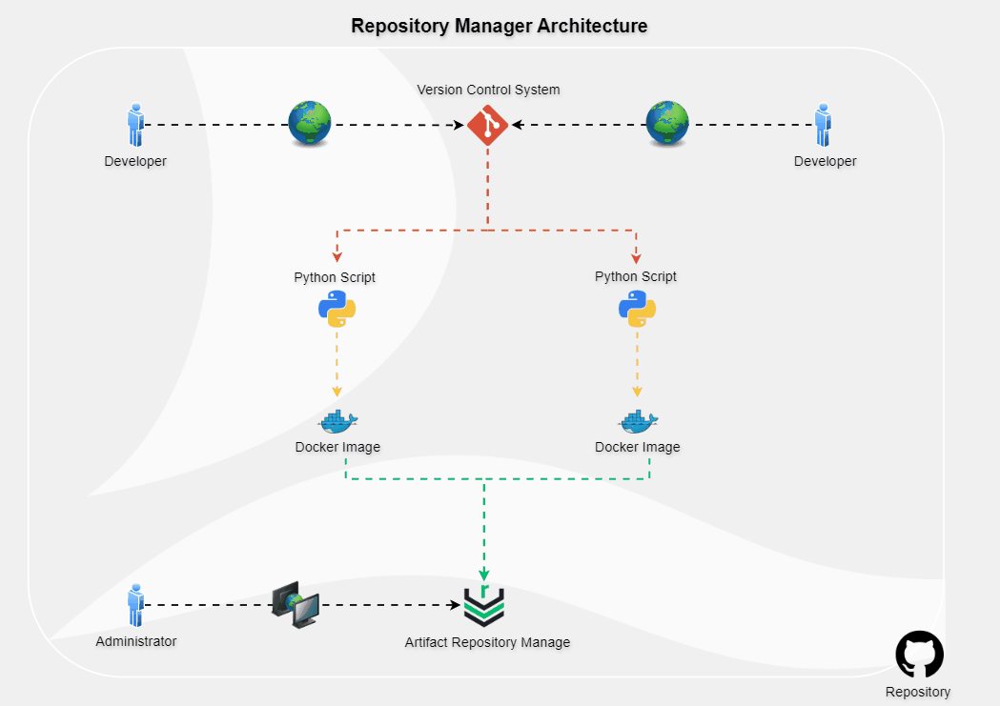

## Overview

This project is a Python application built with Flask, packaged as a Docker image. To efficiently manage and track the Docker images, I have integrated **Nexus** as a Sonatype tool. Nexus provides a user-friendly dashboard to monitor, manage, and tag Docker images with ease.

With this setup, I can now effortlessly manage my Docker images, track live image uploads, count incoming images, apply pipelines, and much more. The entire Nexus setup has also been Dockerized, making it highly effective and easy to deploy across different operating systems.

## Features

- **Image Management**: Efficiently track and manage Docker image tags.
- **Real-time Monitoring**: View images as they are uploaded in real-time.
- **Pipeline Integration**: Apply pipelines for streamlined CI/CD processes.
- **Fully Dockerized**: Nexus is Dockerized for easy deployment and scalability.

## Getting Started

### Prerequisites

- Python
- Docker
- Git

### 1. Clone the Repository

```bash
git clone https://github.com/YakirBar/Repository-Manager-Project.git
```

### 2. Build and Run the Flask Application as a Docker Image

1. Navigate to the application directory:
   ```bash
   cd /Repository-Manager-Project/app
   ```
2. Build the Docker image:
   ```bash
   docker build -t flask-app .
   ```
3. Ensure port 5000 is available.
4. Run the Docker container:
   ```bash
   docker run -d -p 5000:5000 flask-app
   ```
5. Open your browser and go to `http://localhost:5000`.

### 3. Run the Artifact Repository Manager (Nexus)

1. Configure Docker to allow insecure registries:
   ```bash
    nano /etc/docker/daemon.json
   ```
   Add the following line:
   ```json
   {
     "insecure-registries": ["localhost:8082"]
   }
   ```
2. Restart Docker:
   ```bash
   sudo systemctl restart docker
   ```
3. Navigate to the Docker directory:
   ```bash
   cd /Repository-Manager-Project/docker
   ```
4. Ensure ports 8081 & 8082 are available.
5. Run the Nexus Docker container:
   ```bash
   docker-compose up -d
   ```
6. Open your browser and go to `http://localhost:8081`.
7. Log in using the default credentials:
   - **Username**: `admin`
   - **Password**: Retrieve with:
     ```bash
     docker exec -it nexus cat /nexus-data/admin.password
     ```
8. Configure a new Docker repository:
   - Navigate to **Settings** -> **Repositories** -> **Create Repository**.
   - Select **docker (hosted)**.
   - **Name**: `NexusHub`
   - **HTTP**: Enable and set to `8082`.
   - **Enable Docker V1 API**: Choose `yes`.
9. Log in to the Docker repository:
   ```bash
   docker login localhost:8082
   ```
   Use the following credentials:
   - **Username**: `admin`
   - **Password**: (new password created earlier)
10. Tag and push your Docker image:
    ```bash
    docker tag flask-app localhost:8082/nexushub:0.0.1
    docker push localhost:8082/nexushub:0.0.1
    ```
11. View and manage your image tags:
    - Navigate to **Browse** -> **NexusHub** and watch your tags.


## Enjoy!

Now you can manage your Docker images effortlessly with the power of Nexus. Feel free to explore, enhance, and contribute to this project!
